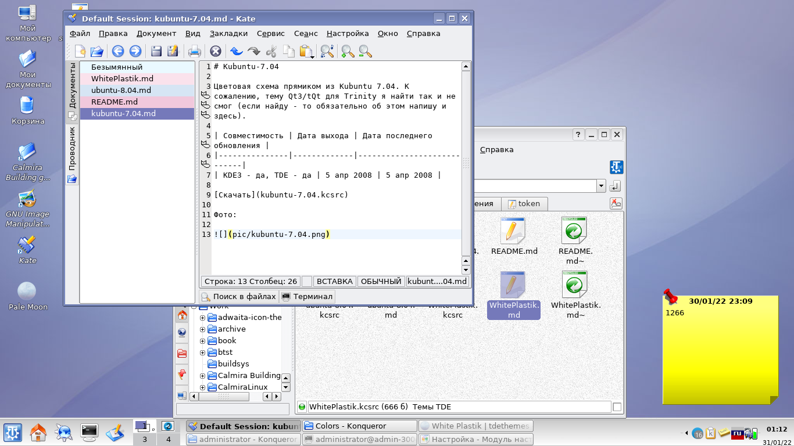

# Kubuntu-7.04

Цветовая схема прямиком из Kubuntu 7.04. К сожалению, тему Qt3/tQt для Trinity я найти так и не смог (если найду - то обязательно об этом напишу и здесь).

| Совместимость | Дата выхода | Дата последнего обновления |
|---------------|-------------|----------------------------|
| KDE3 - да, TDE - да | 5 апр 2008 | 5 апр 2008 |

[Скачать](kubuntu-7.04.kcsrc)

Фото:

